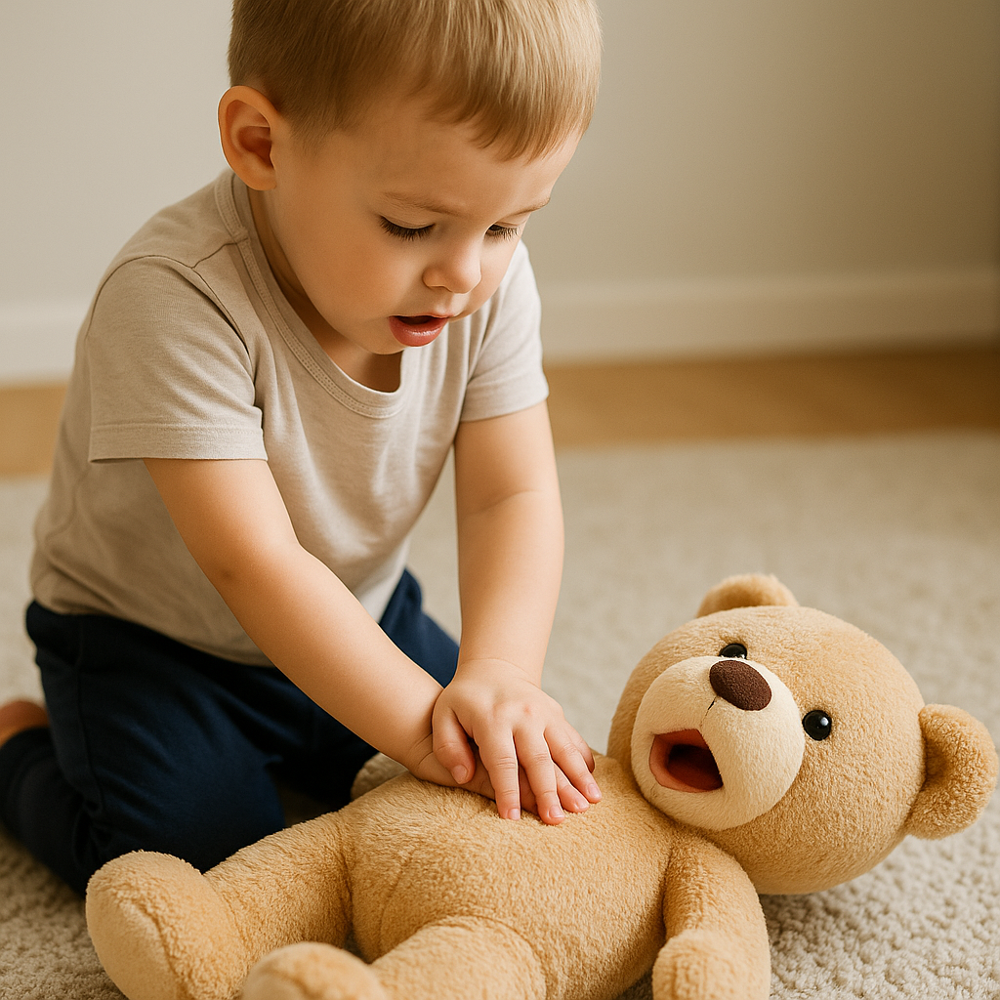

# ❤️ Plushie - breathe with me

Un doudou biomimétique qui respire, s’éteint… et peut être réanimé par massage cardiaque.  
Un objet affectif, éducatif et low-tech, pensé pour éveiller à la tendresse, à la survie et à l’attention.

---

---

## 🌬️ Principe

Le doudou simule une **respiration calme** grâce à un système interne mécanique ou électromécanique (soufflet, pompe, volume mobile).  
Lorsqu’il "s’épuise" (plus d’énergie), il **cesse de respirer** et **ferme les yeux**.

Pour le “réveiller”, il faut **lui faire un massage cardiaque doux**.  
Ce geste :
- Active une **dynamo miniature** ou recharge un composant électrique
- Relance le **cycle de respiration**
- Émet un **son,  lumière ou ouverture des yeux** simulant un retour à la vie

🔧 [Vue d’ensemble technique détaillée](tech/DOUDOU_TECH_OVERVIEW.md)

---

## 🧸 Objectifs

- Apaiser (rythme lent, respiration naturelle)
- Éduquer (gestes de réanimation, lien cause-effet, soin)
- Émerveiller (objets émotionnels à interaction douce)
- Ouvrir des pistes thérapeutiques ou ludiques

---

## 🔬 Inspirations

- Biomimétisme (rythmes biologiques)
- CPR (massage cardiaque) pédagogique
- Jouets affectifs interactifs
- Objets transitionnels pour enfants / TSA / anxiété

---

## ⚙️ Idée technique (à affiner)

- **Soufflet ou pompe interne** (manuel, servo ou passif)
- **Capteur de pression** pour détecter le massage
- **Mini dynamo ou moteur inversé** pour recharge simple
- **Capteur de lumière** pour yeux jour/nuit
- **Corps textile ou imprimé**, ergonomique et tendre

🚀 [Idées futures & extensions](tech/Plushie_FUTURE_IDEAS.md)

---

## 📜 Licence

- **Non-commercial** (Creative Commons BY-NC)
- **Licence commerciale** pour intégration industrielle

---

> “Quand ton geste redonne vie, même les objets respirent à nouveau.”
