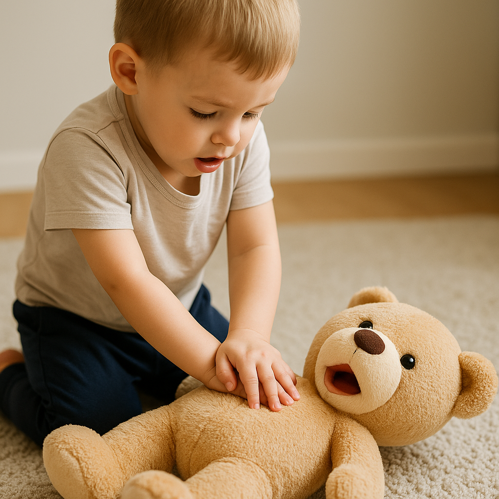

**Language:** [English](#english) | [Français](#francais)

# ❤️ Plushie - breathe with me

A biomimetic comfort plush that breathes, powers down… and can be resuscitated by gentle chest massage.  
An emotional, educational and low‑tech object designed to awaken tenderness, survival instincts and attentiveness.

---

---

## 🌬️ Operating Principle

The plush **breathes gently**: its belly rises (inhalation) and falls (exhalation) thanks to a mini‑pump and internal check‑valves.  
If it is **left untouched for an extended period** (`T_pause`: 10 – 60 min, adjustable), it **falls asleep**: breathing stops and its eyes close (or the heart‑LED fades out).

### ⚡ How to “revive” it?

| Step | Action | What happens |
|------|--------|--------------|
| **1. “Heart‑massage”** | 2 – 4 presses | The **micro‑dynamo** converts the presses into electricity. |
| **2. Energy flash** | 5 F super‑capacitor | Stores the spike and wakes the micro‑controller (MCU). |
| **3. Battery takes over** | 18650 Li‑ion ≈ 3 000 mAh | Powers breathing for **1 – 3 h per day** → **≈ 3 weeks** between USB‑C recharges. |
| **4. Active breathing** | 8 cycles / min | • **Inhale:** pump 30 mA for 0.3 s, intake valve ON. • **Exhale:** silicone outlet valve vents air softly. |
| **5. Auto‑pause** | Inactivity ≥ `T_pause` | MCU stops the pump and returns to deep‑sleep (< 10 µA). A new massage is needed to restart. |

> **Visible effect:** during the massage the plush “comes back to life”: the heart‑LED pulses or its eyes open, then a steady breathing rhythm resumes.

### 🗒️ Energy at a Glance

- The dynamo is **not the main power source**; it simply triggers the system.  
- The battery provides long‑term autonomy.  
- If the child cuddles or moves the plush, the `T_pause` timer resets, so it won’t power down mid‑play.

The toy therefore combines **hands‑on first‑aid interaction** with **extended use** that doesn’t require daily charging.

🔧 [Detailed technical overview](tech/DOUDOU_TECH_OVERVIEW.md)
🔌 [Energy cycle & autonomy](tech/POWER_LIFECYCLE.md)

---

## 🧸 Objectives

- Soothe (slow rhythm, natural breathing)
- Educate (resuscitation gestures, cause‑and‑effect, caring)
- Inspire wonder (soft‑interaction emotional objects)
- Open therapeutic or playful avenues

---

## 🔬 Inspirations

- Biomimicry (biological rhythms)
- CPR (educational chest compressions)
- Interactive emotional toys
- Transitional objects for children / ASD / anxiety

---

## ⚙️ Technical concept (to refine)

- **Pressure sensor** to detect massage
- **Light sensor** for day/night eyes
- **Textile or printed body**, ergonomic and cuddly

🚀 [Future ideas & extensions](tech/Plushie_FUTURE_IDEAS.md)

---

## 👶 Child safety

All materials, dimensions, and assembly methods have been designed to meet toy standards (EN 71-1/2/3).
🔒 Secure casing, countersunk screws, protective foam, cables that can be disconnected before washing, etc.

> 📄 **Full details ➜** [tech/CHILD_SAFETY.md](tech/CHILD_SAFETY.md)

---

## 📜 Licences & legal framework

| Document | Role |
|----------|------|
| **[DUAL_LICENSE.md](governance/DUAL_LICENSE.md)** | Applicable licences (CERN-OHL-S-2.0 / CC-BY-NC-SA-4.0 / MIT) |
| **[LEGAL_NOTICE.md](governance/LEGAL_NOTICE.md)** | Author’s legal notice |
| **[LEGAL_POSITION.md](governance/LEGAL_POSITION.md)** | Clarification: publication of ideas & prior art |
| **[ETHICAL_CHARTER.md](governance/ETHICAL_CHARTER.md)** | Project ethical charter |

---

### 🫶 Support this work

These projects are released as open hardware so anyone can study, adapt and rebuild them.
If you want to support the work, GitHub Sponsors is open:
👉 https://github.com/sponsors/f-buisson

Sponsoring is entirely optional. It grants **no** commercial rights, **no** licence and **no** private access — it simply helps fund materials and prototypes.

---

> “When your gesture brings life back, even objects breathe again.”

# ❤️ Plushie - breathe with me

Un doudou biomimétique qui respire, s’éteint… et peut être réanimé par massage cardiaque.  
Un objet affectif, éducatif et low-tech, pensé pour éveiller à la tendresse, à la survie et à l’attention.

---

---

## 🌬️ Principe de fonctionnement

Le doudou **respire doucement** : son ventre se gonfle (inspiration) puis se dégonfle (expiration) à l’aide d’une mini-pompe et de clapets internes.  
S’il n’est **pas stimulé pendant une longue période** (`T_pause` : 10 – 60 min réglable), il **s’endort** : respiration stoppée, yeux fermés (ou LED cœur éteinte).

### ⚡ Comment le « réanimer » ?

| Étape | Action | Explication |
|-------|--------|-------------|
| **1. Massage « cœur »** | 2 – 4 pressions | La **micro-dynamo** convertit la pression en électricité. |
| **2. Flash d’énergie** | Supercondensateur 5 F | Stocke le pic et réveille le microcontrôleur (MCU). |
| **3. Prise de relais batterie** | Li-ion 18650 ≈ 3 000 mAh | Alimente la respiration **1 – 3 h par jour** → **≈ 3 semaines** d’autonomie entre recharges USB-C. |
| **4. Respiration active** | 8 cycles/min |  • **Inspiration :** pompe 30 mA pendant 0,3 s, clapet entrée ON. • **Expiration :** clapet silicone laisse l’air sortir doucement. |
| **5. Mise en pause auto** | Inactivité ≥ `T_pause` | MCU coupe la pompe, repasse en deep-sleep (< 10 µA). Un nouveau massage est requis pour repartir. |

> **Effet visible :** au massage, le doudou « revient à la vie » : LED cœur qui pulse ou yeux qui s’ouvrent, puis respiration régulière.

### 🗒️ Résumé énergie

- La dynamo **n’est pas la source principale** : elle sert à déclencher.  
- La batterie assure la longue autonomie.  
- Si l’enfant câline ou bouge le doudou, le minuteur `T_pause` est remis à zéro ; il ne s’éteint donc pas en plein jeu. 

Ainsi, le jouet combine **interaction pédagogique** (gestes de premiers secours) et **usage prolongé** sans recharge quotidienne.

🔧 [Vue d’ensemble technique détaillée](tech/DOUDOU_TECH_OVERVIEW.md)
🔌 [Cycle énergétique & autonomie](tech/POWER_LIFECYCLE.md)

---

## 🧸 Objectifs

- Apaiser (rythme lent, respiration naturelle)
- Éduquer (gestes de réanimation, lien cause-effet, soin)
- Émerveiller (objets émotionnels à interaction douce)
- Ouvrir des pistes thérapeutiques ou ludiques

---

## 🔬 Inspirations

- Biomimétisme (rythmes biologiques)
- CPR (massage cardiaque) pédagogique
- Jouets affectifs interactifs
- Objets transitionnels pour enfants / TSA / anxiété

---

## ⚙️ Idée technique (à affiner)

- **Capteur de pression** pour détecter le massage
- **Capteur de lumière** pour yeux jour/nuit
- **Corps textile ou imprimé**, ergonomique et tendre

🚀 [Idées futures & extensions](tech/Plushie_FUTURE_IDEAS.md)

---

## 👶 Child safety

Tous les matériaux, dimensions et méthodes d’assemblage ont été pensés pour répondre aux normes jouets (EN 71-1/2/3).  
🔒 Boîtier sécurisé, vis noyées, mousse de protection, câbles débranchables avant lavage, etc.

> 📄 **Détails complets ➜** [tech/CHILD_SAFETY.md](tech/CHILD_SAFETY.md)

---

## 📜 Licences & cadre légal  

| Document | Rôle |
|----------|------|
| **[DUAL_LICENSE.md](governance/DUAL_LICENSE.md)** | Licences applicables (CERN-OHL-S-2.0 / CC-BY-NC-SA-4.0 / MIT) |
| **[LEGAL_NOTICE.md](governance/LEGAL_NOTICE.md)** | Mentions légales de l’auteur |
| **[LEGAL_POSITION.md](governance/LEGAL_POSITION.md)** | Précision : publication d’idées + antériorité |
| **[ETHICAL_CHARTER.md](governance/ETHICAL_CHARTER.md)** | Charte éthique du projet |

---

### 🫶 Soutenir ce travail

Ces projets sont publiés en open hardware pour que chacun puisse les étudier, les adapter et les reconstruire.
Si vous souhaitez soutenir ce travail, GitHub Sponsors est ouvert :
👉 https://github.com/sponsors/f-buisson

Le sponsoring est entièrement facultatif. Il n’ouvre **aucun** droit commercial, **aucune** licence et **aucun** accès privé — il aide simplement à financer le matériel et les prototypes.

---

> “Quand ton geste redonne vie, même les objets respirent à nouveau.”
