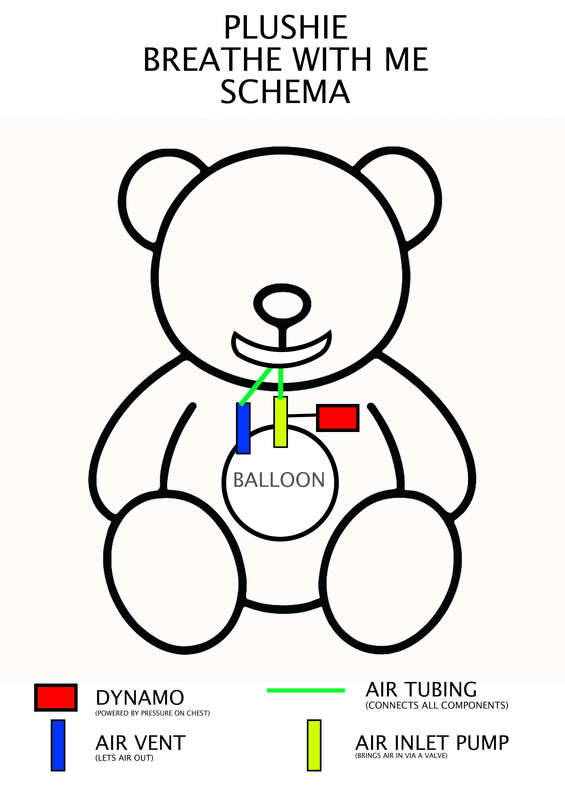

# ⚙️ Fonctionnement de Plushie - breathe with me

Le Doudou est conçu pour simuler une **respiration rythmée**, apportant un **réconfort émotionnel et tactile** à l’enfant à travers des cycles réalistes d’**inspiration et d’expiration**. Un système interne composé d’un ballon souple, d’un circuit d’air unidirectionnel et d’un mécanisme d’activation alimenté par une micro-dynamo permet d’imiter le souffle naturel, de façon passive et douce.

Mais l’innovation majeure du Doudou réside dans sa **capacité à "s’arrêter de respirer"** et à pouvoir être **réanimé manuellement**. Si le doudou cesse toute activité (par exemple après une longue période d'inutilisation), un **massage cardiaque doux** exercé sur la zone du cœur relance la dynamo et permet au cycle respiratoire de reprendre. Ce mécanisme rend l’objet **interactif et éducatif**, en sensibilisant l’enfant aux gestes de premiers secours dans une logique ludique et symbolique.

Cette fonctionnalité de **réanimation simulée** donne vie au Doudou, en renforçant le lien affectif et en favorisant une **prise de conscience précoce de l'importance de prendre soin de l’autre**.

---

## 🔋 Énergie embarquée

- Le système est **alimenté via une dynamo intégrée**.
- Cette dynamo est **activée par pression manuelle** sur la zone du "cœur" du Doudou (massage cardiaque).
- L’énergie générée permet d’actionner :
  - une **pompe inspirante miniature** pour gonfler le ballon interne,
  - un **petit circuit de contrôle** (clignement des yeux, rythme…).

Quand la dynamo est vide :
- Le Doudou cesse de respirer (comme endormi).
- L’utilisateur doit **réactiver la dynamo** pour "le réveiller".

---

## 🌬️ Respiration simulée (inspiration/expiration)

- **Inspiration :**
  - L’énergie de la dynamo alimente une **pompe unidirectionnelle** qui remplit un **ballon souple** à l’intérieur du Doudou.
  - L’entrée d’air est régulée via un **clapet d’admission** (anti-retour).

- **Expiration :**
  - Lorsque le ballon atteint un **volume maximal**, un système **mécanique de purge** s’ouvre (pression ou volume seuil).
  - L’air s’évacue via une sortie d’air, simulant une **expiration douce**.

- **Blocage alterné entrée/sortie :**
  - L’entrée est **automatiquement bloquée** pendant la phase d’expiration, et inversement, assurant un cycle respiratoire fluide.

---

## 👁️ Clignement des yeux (optionnel)

- Un **capteur de lumière** permet de déclencher le clignement régulier des yeux du Doudou (ex. toutes les 20 sec).
- Ce module consomme peu et fonctionne tant que la dynamo a de l’énergie.

---

# ⚙️ How Plushie – breathe with me Works

The Plushie is designed to simulate **rhythmic breathing**, providing **emotional and tactile comfort** to the child through realistic cycles of **inhalation and exhalation**.  
An internal system made up of a flexible bladder, a one‑way air circuit and a micro‑dynamo‑powered activation mechanism imitates natural breathing in a gentle, passive manner.

The major innovation of the Plushie lies in its **ability to “stop breathing”** and be **manually resuscitated**.  
If the Plushie ceases all activity (for example after a long period of disuse), a **gentle chest massage** applied to the heart area restarts the dynamo and allows the breathing cycle to resume. This mechanism makes the object **interactive and educational**, raising the child’s awareness of first‑aid gestures in a playful, symbolic way.

This **simulated resuscitation** feature brings the Plushie to life, strengthening the emotional bond and fostering an **early awareness of the importance of caring for others**.

---

## 🔋 On‑board Energy

- The system is **powered by an integrated dynamo**.  
- This dynamo is **activated by manual pressure** on the Plushie’s “heart” area (chest massage).  
- The generated energy powers:  
  - a **mini inhalation pump** that inflates the internal bladder,  
  - a **small control circuit** (eye blinking, rhythm, etc.).  

When the dynamo is empty:  
- The Plushie stops breathing (as if asleep).  
- The user must **reactivate the dynamo** to “wake it up”.

---

## 🌬️ Simulated Breathing (Inhalation/Exhalation)

- **Inhalation:**  
  - Dynamo energy powers a **one‑way pump** that fills a **flexible bladder** inside the Plushie.  
  - Air intake is regulated by an **admission check valve**.

- **Exhalation:**  
  - When the bladder reaches a **maximum volume**, a **mechanical purge system** opens (pressure or volume threshold).  
  - The air is expelled through an outlet, simulating a **gentle exhalation**.

- **Alternating inlet/outlet blocking:**  
  - The inlet is **automatically blocked** during exhalation, and vice versa, ensuring a smooth breathing cycle.

---

## 👁️ Eye Blinking (Optional)

- A **light sensor** triggers regular blinking of the Plushie’s eyes (e.g. every 20 s).  
- This module consumes little power and operates as long as the dynamo has energy.

